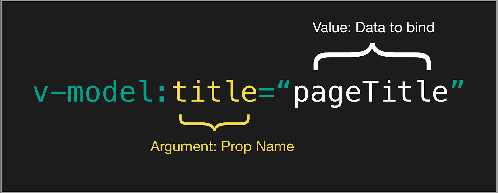

# change

## Global Api

### 1. Vue全局的修改
```javascript
//  Vue全局api
Vue.component()
Vue.use()
Vue.mixin()
Vue.directive()
```
vue2上存在的问题是：

1. 从同一Vue构造函数创建的每个根实例都共享相同的全局配置。 导致同一个页面上的两个实例，难以分别配置

2.  对测试不友好, 测试需要在每次测试后将测试用例还原，以免污染其他测试案例

**vue3.0  createApp**
```javascript
//  2.0 上的全局配置， 实际上没有app的概念

//  3.0上的新概念
import { createApp } from 'vue'

const app = createApp({})
```
2x Global API | 3x Instance API
:-|-|-
Vue.config | app.config
Vue.config.productionTip | removed
Vue.config.ignoredElements | app.config.isCustomElement
Vue.component | app.component
Vue.directive | 	app.directive
Vue.mixin | 	app.mixin

**最大的变化就是抽象出app的概念。将之前的Vue全局字面量的配置，修改为一个app实例的配置。这样可以做到更配置灵活， 另外这些全局方法只能通过es6的模块化引入， 拥有更好的treeSharking**

- Vue.config.productionTip 配置被移除  

  这是一个启动生产提示， 设为true时会多一条'you are running Vue in development mode' 的提示。在3.0中这个提示 仅在'dev + full build'时存在，并且现在的单页应用在绝大多数情况下脚手架都正确配置了环境， 所以移除。

- config.ignoredElements -> config.isCustomElement
```javascript
// before
Vue.config.ignoredElements = ['my-el', /^ion-/]

// after
const app = Vue.createApp({})
app.config.isCustomElement = tag => tag.startsWith('ion-')
```  

这个配置的作用是告诉vue,这是一个自定义元素而不是组件。3.0中用一个方法取代正则， 更具有灵活性。

- 插件如何安装

```JAVASCRIPT
//  2.0 是window.vue.use(VueRouter)

const app = createApp(MyApp)
app.use(VueRouter)
```

- 如何挂载vue, 创建vue组件， 自定义指令
```javascript
const app = createApp(MyApp)

app.component('button-counter', {
  data: () => ({
    count: 0
  }),
  template: '<button @click="count++">Clicked {{ count }} times.</button>'
})

app.directive('focus', {
  mounted: el => el.focus()
})

// now every application instance mounted with app.mount(), along with its
// component tree, will have the same “button-counter” component
// and “focus” directive without polluting the global environment
app.mount('#app')
```

- provide/inject
```javascript
// in the entry
app.provide('guide', 'Vue 3 Guide')

// in a child component
export default {
  inject: {
    book: {
      from: 'guide'
    }
  },
  template: `<div>{{ book }}</div>`
}
```
provide 依赖后其子组件可随意inject

- 不同实例间共享配置  
v-focus将在Foo和Bar组件以及其后代可得

```javascript
import { createApp } from 'vue'
import Foo from './Foo.vue'
import Bar from './Bar.vue'

const createMyApp = options => {
  const app = createApp(options)
  app.directive('focus' /* ... */)

  return app
}

createMyApp(Foo).mount('#foo')
createMyApp(Bar).mount('#bar')
```

### 2. vue 3.0 更好的treeSharking
3.0 中的api 都面向treeSharking重新组值，3.0api 只能按模块化方式引入， 这样没有使用的模块将不会打入bundle。

以下api受到影响：
- Vue.nextTick
- Vue.observable (replaced by Vue.reactive)
- Vue.version
- Vue.compile (only in full builds)
- Vue.set (only in compat builds)
- Vue.delete (only in compat builds)

```javascript
// 也就是说这些api 只能通过模块化导入
import { nextTick } from 'vue'

import { h, Transition, withDirectives, vShow } from 'vue'
```

### 3. Inline Template不再支持

```javascript
// 跟solt差不多， 使用my-component中的模板来渲染， 分布式渲染。
<my-component inline-template>
  <div>
    <p>These are compiled as the component's own template.</p>
    <p>Not parent's transclusion content.</p>
  </div>
</my-component>
```

在3.0中可以使用solt 或者 通过id绑定template。

### 4. key
- 3.0中 v-if/v-else/v-else-if 不用添加key, vue内部会自动生成key
- \<template v-for> key应该绑定在template上， 而不是其children上
- virtual-dom pacth 的时候key 作为节点的表示， vue通过key来复用和重新对节点编号。要是没有key,vue将重新执行diff算法， 所以key 是diff 的优化策略

### 5. KeyCode Modifiers
由于web标准中KeyboardEvent.keyCode被废弃。在vue2.0中以下形式将不在支持。
```javascript
<input v-on:keyup.13="submit" />

Vue.config.keyCodes = {
  f1: 112
}

<input v-on:keyup.f1="showHelpText" />
```

vue3.0
```javascript
<!-- Vue 3 Key Modifier on v-on -->
<input v-on:keyup.delete="confirmDelete" />
```

### 6. 设置props 的默认值
```javascript
import { inject } from 'vue'

export default {
  props: {
    theme: {
      default (props) {
        // `props` is the raw values passed to the component,
        // before any type / default coercions
        // can also use `inject` to access injected properties
        return inject('theme', 'default-theme')
      }
    }
  }
}
```

### 7. render

### 8. slot

### 9. Transition Class Change
- Replace instances of .v-enter to .v-enter-from
- Replace instances of .v-leave to .v-leave-from

### 10. v-model

- 组件的v-model 由之前的value 改为  modelValue
- v-bind.sync 修饰符 改为 v-model:title="pageTitle"
- 现在v-model 可以同时绑定多个值
- 现在可以自定义v-model 修饰符

```javascript
// vue2.0 组件上的v-model 是v-bind:value  v-on:input 的语法糖
// 绑定值value 和 事件input是不可改变的
<ChildComponent v-model="pageTitle" />

// would be shorthand for

<ChildComponent :value="pageTitle" @input="pageTitle = $event" />
```

```javascript
// 在vue 2.2 以后新增加了model选项用以之前v-model语法糖绑定值和绑定事件的修改

//  这有个缺点就是只能单个组件的修改， 无法批量

//  以下将value -> checked, input -> change
Vue.component('my-checkbox', {
  model: {
    prop: 'checked',
    event: 'change'
  },
  props: {
    // this allows using the `value` prop for a different purpose
    value: String,
    // use `checked` as the prop which take the place of `value`
    checked: {
      type: Number,
      default: 0
    }
  },
  // ...
})
```

```javascript
// 在vue3.0 上是默认是绑定在modelValue字段上
// 
<ChildComponent v-model="pageTitle" />

// <!-- would be shorthand for: -->

<ChildComponent
  :modelValue="pageTitle"
  @update:modelValue="pageTitle = $event"
/>

// 如果加上title参数，那么就绑定在title上

<ChildComponent v-model:title="pageTitle" />

<ChildComponent :title="pageTitle" @update:title="pageTitle = $event" />

// 绑定多个值
<ChildComponent v-model:title="pageTitle" v-model:content="pageContent" />

<ChildComponent
  :title="pageTitle"
  @update:title="pageTitle = $event"
  :content="pageContent"
  @update:content="pageContent = $event"
/>

// 允许自定义修饰符
<ChildComponent v-model.capitalize="pageTitle" />
```



```javascript
<ChildComponent v-model="pageTitle" />

// ChildComponent.vue

export default {
  props: {
    modelValue: String // previously was `value: String`
  },
  methods: {
    changePageTitle(title) {
      this.$emit('update:modelValue', title) // previously was `this.$emit('input', title)`
    }
  }
}
```

### 11. v-if v-for
在2.0中 v-for 优先
在3.0中v-if 优先

推荐实现是， 声明一个computed来过滤掉不可见元素

### 12. v-bind 的绑定顺序会影响结果

```javascript
//  也就是说，后面声明的优先更高
<!-- template -->
<div id="red" v-bind="{ id: 'blue' }"></div>
<!-- result -->
<div id="blue"></div>

<!-- template -->
<div v-bind="{ id: 'blue' }" id="red"></div>
<!-- result -->
<div id="red"></div>
```