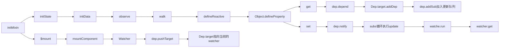

# Vue 的更新主要就是 通过diff算法实现的

**接上文**



可见执行watcher中的get()来更新视图，实际上就是watcher实例时传入的updateComponent方法。

我们来看mounted时实例的一个render-watcher

```javascript
export function mountComponent (
  vm: Component,
  el: ?Element,
  hydrating?: boolean
): Component {
  vm.$el = el
  callHook(vm, 'beforeMount')

  let updateComponent
  /* istanbul ignore if */
  if (process.env.NODE_ENV !== 'production' && config.performance && mark) {
    updateComponent = () => {
      const name = vm._name
      const id = vm._uid
      const startTag = `vue-perf-start:${id}`
      const endTag = `vue-perf-end:${id}`

      mark(startTag)
      const vnode = vm._render()
      mark(endTag)
      measure(`vue ${name} render`, startTag, endTag)

      mark(startTag)
      vm._update(vnode, hydrating)
      mark(endTag)
      measure(`vue ${name} patch`, startTag, endTag)
    }
  } else {
    updateComponent = () => {
      vm._update(vm._render(), hydrating)
    }
  }
```

可见updateComponent 就是对vm._update 的封装

```javascript

Vue.prototype._update = function (vnode: VNode, hydrating?: boolean) {
    const vm: Component = this
    const prevEl = vm.$el
    const prevVnode = vm._vnode
    const restoreActiveInstance = setActiveInstance(vm)
    vm._vnode = vnode
    // Vue.prototype.__patch__ is injected in entry points
    // based on the rendering backend used.
    if (!prevVnode) {
      // initial render
      /* 第一次更新, 传的参数是preNode, vNode */
      vm.$el = vm.__patch__(vm.$el, vnode, hydrating, false /* removeOnly */)
    } else {
      // updates
      vm.$el = vm.__patch__(prevVnode, vnode)
    }
    restoreActiveInstance()
    // update __vue__ reference
    if (prevEl) {
      prevEl.__vue__ = null
    }
    if (vm.$el) {
      vm.$el.__vue__ = vm
    }
    // if parent is an HOC, update its $el as well
    if (vm.$vnode && vm.$parent && vm.$vnode === vm.$parent._vnode) {
      vm.$parent.$el = vm.$el
    }
    // updated hook is called by the scheduler to ensure that children are
    // updated in a parent's updated hook.
  }
```

vm._update主要是执行vm.__patch__, __patch__是在打包的入口函数中注册的。  
进入patch方法

```javascript
// src/platforms/web/runtime/patch.js
/* @flow */
/* nodeOps就是写Dom 的操作方法：createElement，createElementNS， insertBefore， removeChild等 */
import * as nodeOps from 'web/runtime/node-ops'
import { createPatchFunction } from 'core/vdom/patch'

/* [ref, directives] ref和自定义指令相关*/
import baseModules from 'core/vdom/modules/index'

/* [
  attrs,
  klass,
  events,
  domProps,
  style,
  transition
] */
import platformModules from 'web/runtime/modules/index'

// the directive module should be applied last, after all
// built-in modules have been applied.
/* 合并方法 */
const modules = platformModules.concat(baseModules)

export const patch: Function = createPatchFunction({ nodeOps, modules })
```

接着进入核心的createPathFunction 方法

```javascript
// src/core/vdom/patch.js

```


