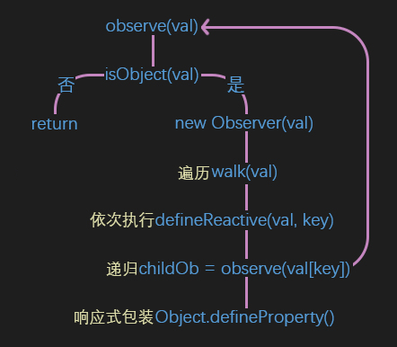
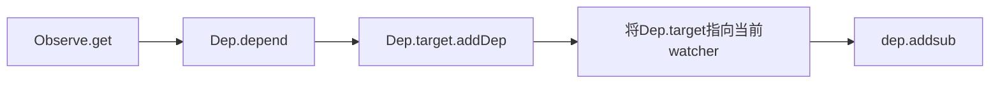
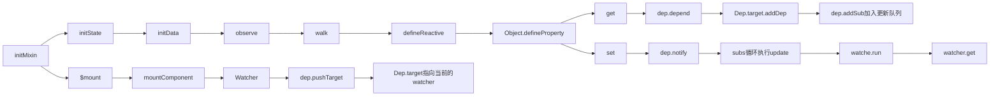
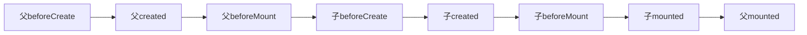

# 响应式原理 Observe

## 问题
1. Watcher、Dep、Observe 分别是什么？ 三者是什么关系？
2. 如何实现响应式？

## 一 vue 初始化流程
<div style="text-align: center">
  
</div>

### 响应式总结
vue 主要是三个阶段， 初始化阶段， 依赖收集阶段， 响应阶段  
get时收集依赖， set时触发更新  


vue 入口函数

``` javascript

function Vue (options) {
  if (process.env.NODE_ENV !== 'production' &&
    !(this instanceof Vue)
  ) {
    warn('Vue is a constructor and should be called with the `new` keyword')
  }
  this._init(options)
}
/* 事件， data初始化 */
initMixin(Vue)
stateMixin(Vue)
eventsMixin(Vue)
lifecycleMixin(Vue)
renderMixin(Vue)

export default Vue
```
这是vue的构造函数，这些mixin方法主要是往Vue.prototype上挂载属性和方法，
这里为什么要这么写，而不是直接写在Vue里面？
这里主要关注initMixin 方法。

```javascript
export function initMixin (Vue: Class<Component>) {
  Vue.prototype._init = function (options?: Object) {
    /* vm指向构造函数Vue this */
    const vm: Component = this
    // a uid
    vm._uid = uid++

    let startTag, endTag
    /* istanbul ignore if */
    if (process.env.NODE_ENV !== 'production' && config.performance && mark) {
      startTag = `vue-perf-start:${vm._uid}`
      endTag = `vue-perf-end:${vm._uid}`
      mark(startTag)
    }

    // a flag to avoid this being observed
    vm._isVue = true
    // merge options
    if (options && options._isComponent) {
      // optimize internal component instantiation
      // since dynamic options merging is pretty slow, and none of the
      // internal component options needs special treatment.

      /* _isComponent 区分是根组件还是内部组件 */
      initInternalComponent(vm, options)
    } else {
      /* 根组件 */
      /* mergeOptions 将组件中的模板语法参数 挂载到$options 上 */
      vm.$options = mergeOptions(
        resolveConstructorOptions(vm.constructor),
        options || {},
        vm
      )
    }
    /* istanbul ignore else */
    if (process.env.NODE_ENV !== 'production') {
      initProxy(vm)
    } else {
      vm._renderProxy = vm
    }
    // expose real self
    vm._self = vm
    /* 在vm 上挂载 $root $parent $children $refs _watcher _inactive _directInactive _isMounted _isDestroyed _isBeingDestroyed 属性*/
    initLifecycle(vm)
    initEvents(vm)
    /* 记录vnode 位置等，渲染的上下文 */
    initRender(vm)
    callHook(vm, 'beforeCreate')
    /* 实现 provide 和 inject 功能 */
    initInjections(vm) // resolve injections before data/props
    /* 初始化props, watches, methods, initData() */
    initState(vm)
    /* 实现 provide 和 inject 功能 */
    initProvide(vm) // resolve provide after data/props
    callHook(vm, 'created')

    /* istanbul ignore if */
    if (process.env.NODE_ENV !== 'production' && config.performance && mark) {
      vm._name = formatComponentName(vm, false)
      mark(endTag)
      measure(`vue ${vm._name} init`, startTag, endTag)
    }

    if (vm.$options.el) {
      vm.$mount(vm.$options.el)
    }
  }
}
```

这里可以看到主要是在初始化生命周期、事件，callHook 方法能发现 **生命周期就是组件在各个状态下的回调函数**。
我们关注点在initState()方法， 注意vm.$mount也是在这里执行的（mount的后面再说）

```javascript
export function initState (vm: Component) {
  vm._watchers = []
  const opts = vm.$options
  if (opts.props) initProps(vm, opts.props)
  if (opts.methods) initMethods(vm, opts.methods)
  if (opts.data) {
    initData(vm)
  } else {
    observe(vm._data = {}, true /* asRootData */)
  }
  if (opts.computed) initComputed(vm, opts.computed)
  if (opts.watch && opts.watch !== nativeWatch) {
    initWatch(vm, opts.watch)
  }
}
```
接着进入initData

```javascript
function initData (vm: Component) {
  let data = vm.$options.data
  data = vm._data = typeof data === 'function'
    ? getData(data, vm)
    : data || {}
  if (!isPlainObject(data)) {
    data = {}
    process.env.NODE_ENV !== 'production' && warn(
      'data functions should return an object:\n' +
      'https://vuejs.org/v2/guide/components.html#data-Must-Be-a-Function',
      vm
    )
  }
  // proxy data on instance
  const keys = Object.keys(data)
  const props = vm.$options.props
  const methods = vm.$options.methods
  let i = keys.length
  /* while循环效率优于 for等，数量越大越明显 */
  while (i--) {
    const key = keys[i]
    if (process.env.NODE_ENV !== 'production') {
      if (methods && hasOwn(methods, key)) {
        warn(
          `Method "${key}" has already been defined as a data property.`,
          vm
        )
      }
    }
    if (props && hasOwn(props, key)) {
      process.env.NODE_ENV !== 'production' && warn(
        `The data property "${key}" is already declared as a prop. ` +
        `Use prop default value instead.`,
        vm
      )
    } else if (!isReserved(key)) {
      /* isReserved 检查 key是否以 $ 或 _ 开头*/
      /* vm上修改_data中的key, 也能响应 */
      proxy(vm, `_data`, key)
    }
  }
  // observe data
  observe(data, true /* asRootData */)
}
```

## 二 创建响应式数据

```javascript
export function observe (value: any, asRootData: ?boolean): Observer | void {
  if (!isObject(value) || value instanceof VNode) {
    return
  }
  let ob: Observer | void
  /* __ob__ 表示数据已经是响应式了 */
  if (hasOwn(value, '__ob__') && value.__ob__ instanceof Observer) {
    ob = value.__ob__
  } else if (
    shouldObserve &&
    !isServerRendering() &&
    (Array.isArray(value) || isPlainObject(value)) &&
    Object.isExtensible(value) &&
    !value._isVue
  ) {
    ob = new Observer(value)
  }
  if (asRootData && ob) {
    ob.vmCount++
  }
  return ob
}
```
oberve 就是Observer 类的实例

```javascript
/* 将数据拦截，get 触发收集依赖， set触发 更新dom， dep.notify -> watcher.update */
export class Observer {
  value: any;
  dep: Dep;
  vmCount: number; // number of vms that have this object as root $data

  constructor (value: any) {
    this.value = value
    this.dep = new Dep()
    this.vmCount = 0
    /* vue.__ob__ 指向Observer的this */
    /* 拦截__ob__属性 */
    def(value, '__ob__', this)
    if (Array.isArray(value)) {
      /* 是否有__proto__属性 */
      /* 通过重写数组方法实现，实现对数组的拦截， 有局限性比如通过下标改变数据 */
      if (hasProto) {
        protoAugment(value, arrayMethods)
      } else {
        copyAugment(value, arrayMethods, arrayKeys)
      }
      this.observeArray(value)
    } else {
      this.walk(value)
    }
  }
```
首先在这个类中我们第一次看到 Dep类, dep实例是Observe类的一个属性。
其次看下面两个方法。
copyAugment主要是对数组方法splice, push,shift, pop进行重写以达到监听拦截的目的。这样做的缺陷就是无法监听到通过下标的修改。

```javascript
const methodsToPatch = [
  'push',
  'pop',
  'shift',
  'unshift',
  'splice',
  'sort',
  'reverse'
]

methodsToPatch.forEach(function (method) {
  // cache original method
  /* 拿到原生方法 */
  const original = arrayProto[method]
  def(arrayMethods, method, function mutator (...args) {
    /* 调用原生方法，拿到执行结果 */
    const result = original.apply(this, args)
    const ob = this.__ob__
    let inserted
    switch (method) {
      case 'push':
      case 'unshift':
        inserted = args
        break
      case 'splice':
        inserted = args.slice(2)
        break
    }
    if (inserted) ob.observeArray(inserted)
    // notify change
    /* 每次执行这些方法 都会将变更通知出去，更新视图 */
    ob.dep.notify()
    return result
  })
})
```
walk主要是循环object属性对其监听拦截。

``` javascript
walk (obj: Object) {
    const keys = Object.keys(obj)
    for (let i = 0; i < keys.length; i++) {
      defineReactive(obj, keys[i])
    }
  }
```

```javascript
export function defineReactive (
  obj: Object,
  key: string,
  val: any,
  customSetter?: ?Function,
  shallow?: boolean
) {
  const dep = new Dep()
  /* 属性描述符 */
  const property = Object.getOwnPropertyDescriptor(obj, key)
  if (property && property.configurable === false) {
    return
  }

  // cater for pre-defined getter/setters
  /* 在obj 本身设置了get,set得时候，优先获取原来的getter、setter */
  const getter = property && property.get
  const setter = property && property.set
  if ((!getter || setter) && arguments.length === 2) {
    val = obj[key]
  }

  /* 如果value还是object, 那就循环调用observe */
  let childOb = !shallow && observe(val)
  /* 这个方法是对对象属性的拦截， 无法追踪数组， 无法追踪对象新增属性和删除属性 */
  Object.defineProperty(obj, key, {
    enumerable: true,
    configurable: true,
    get: function reactiveGetter () {
      const value = getter ? getter.call(obj) : val
      /* 注意这是Dep类的属性， 而不是实例属性 */
      if (Dep.target) {
        /* 调用dep.target指向的 watcher的addDep 加入依赖 */
        dep.depend()
        if (childOb) {
          childOb.dep.depend()
          if (Array.isArray(value)) {
            /* 这个方法最后调用的也是dep.depend */
            dependArray(value)
          }
        }
      }
      return value
    },
    set: function reactiveSetter (newVal) {
      const value = getter ? getter.call(obj) : val
      /* eslint-disable no-self-compare */
      if (newVal === value || (newVal !== newVal && value !== value)) {
        return
      }
      /* eslint-enable no-self-compare */
      if (process.env.NODE_ENV !== 'production' && customSetter) {
        customSetter()
      }
      // #7981: for accessor properties without setter
      if (getter && !setter) return
      if (setter) {
        setter.call(obj, newVal)
      } else {
        val = newVal
      }
      childOb = !shallow && observe(newVal)
      /* 遍历watcher 执行update 方法 */
      dep.notify()
    }
  })
}
```
```javascript
function dependArray (value: Array<any>) {
  for (let e, i = 0, l = value.length; i < l; i++) {
    e = value[i]
    e && e.__ob__ && e.__ob__.dep.depend()
    if (Array.isArray(e)) {
      dependArray(e)
    }
  }
}
```


这是观察者的核心方法， 通过Object.defineProperty方法对data的每一个属性进行拦截，在get是时候收集依赖，set的时候更新视图。
因为Object.defineProperty只能拦截对象的属性，这也是vue3.0 将拦截方式改为 [proxy](https://es6.ruanyifeng.com/#docs/proxy) 的原因之一。
看到这里可以发现收集依赖和触发更新都是通过dep 类实现得。

## <span id="updateComponent">三 什么是收集依赖</span>
我们先来看下依赖得管理器Dep类

```javascript
export default class Dep {
  /* target 就是 watcher */
  static target: ?Watcher;
  id: number;
  subs: Array<Watcher>;

  constructor () {
    this.id = uid++
    /* 这是一个watcher 队列 */
    this.subs = []
  }

  addSub (sub: Watcher) {
    this.subs.push(sub)
  }

  removeSub (sub: Watcher) {
    remove(this.subs, sub)
  }

  depend () {
    if (Dep.target) {
      /* 实际就是watcher.addDep */
      Dep.target.addDep(this)
    }
  }

  notify () {
    // stabilize the subscriber list first
    const subs = this.subs.slice()
    if (process.env.NODE_ENV !== 'production' && !config.async) {
      // subs aren't sorted in scheduler if not running async
      // we need to sort them now to make sure they fire in correct
      // order
      /* 按加入队列的先后顺序执行update */
      subs.sort((a, b) => a.id - b.id)
    }
    /* 一次更新包含多个watcher */
    for (let i = 0, l = subs.length; i < l; i++) {
      /* 这里开始运行watcher的 update 方法 */
      subs[i].update()
    }
  }
}

  // The current target watcher being evaluated.
  // This is globally unique because only one watcher
  // can be evaluated at a time.
  /* 同时只能有一个watcher执行 */

  /* 只有两种这两种方法可以改变 Dep.target */
  Dep.target = null
  const targetStack = []

  export function pushTarget (target: ?Watcher) {
    targetStack.push(target)
    Dep.target = target
  }

  export function popTarget () {
    targetStack.pop()
    Dep.target = targetStack[targetStack.length - 1]
  }
  /* 这里我们要注意，pushTargrt 和 popTarget调用的地方 */
  /* 可以明确的是在Observer.get之前肯定会先pushTargrt,以保证成功收集依赖 */
```
**总结一下**  

Dep 就是watcher的一个管理器。
- 收集watcher
- 触发watcher更新

注意这里的Dep.target, 这个全局属性执行是当前的watcher。

在Observe --> defineProperty --> get --> dep.depend() 方法， 就是将当前的watcher push 到subs 队列中。

在Observe --> defineProperty --> set --> dep.notify() 方法， 就是循环subs 执行watchers.update 方法。

## 四 依赖就是Watcher

**为了说明watcher,我们回到页面初始化方法initMixin(), 这个方法最后 vm.$mount(vm.$options.el)**

```javascript
// public mount method
Vue.prototype.$mount = function (
  el?: string | Element,
  hydrating?: boolean
): Component {
  el = el && inBrowser ? query(el) : undefined
  return mountComponent(this, el, hydrating)
}

```

在/src/platforms/web/runtime/index.js 中找到 $mount 定义的地方， 进入mountComponent

```javascript
export function mountComponent (
  vm: Component,
  el: ?Element,
  hydrating?: boolean
): Component {
  vm.$el = el
  if (!vm.$options.render) {
    vm.$options.render = createEmptyVNode
  }
  callHook(vm, 'beforeMount')

  let updateComponent
  /* istanbul ignore if */
  if (process.env.NODE_ENV !== 'production' && config.performance && mark) {
    updateComponent = () => {
      const name = vm._name
      const id = vm._uid
      const startTag = `vue-perf-start:${id}`
      const endTag = `vue-perf-end:${id}`

      mark(startTag)
      const vnode = vm._render()
      mark(endTag)
      measure(`vue ${name} render`, startTag, endTag)

      mark(startTag)
      vm._update(vnode, hydrating)
      mark(endTag)
      measure(`vue ${name} patch`, startTag, endTag)
    }
  } else {
    updateComponent = () => {
      vm._update(vm._render(), hydrating)
    }
  }

  // we set this to vm._watcher inside the watcher's constructor
  // since the watcher's initial patch may call $forceUpdate (e.g. inside child
  // component's mounted hook), which relies on vm._watcher being already defined

  // 这是一个render-watcher
  /* updateComponent方法执行vm_update() */
  /*  */
  new Watcher(vm, updateComponent, noop, {
    before () {
      if (vm._isMounted && !vm._isDestroyed) {
        callHook(vm, 'beforeUpdate')
      }
    }
  }, true /* isRenderWatcher */)
  hydrating = false

  // manually mounted instance, call mounted on self
  // mounted is called for render-created child components in its inserted hook
  if (vm.$vnode == null) {
    vm._isMounted = true
    callHook(vm, 'mounted')
  }
  return vm
}
```

接下来 我们进入Watcher 类：

```javascript
export default class Watcher {
  vm: Component;
  expression: string;
  cb: Function;
  id: number;
  deep: boolean;
  user: boolean;
  lazy: boolean;
  sync: boolean;
  dirty: boolean;
  active: boolean;
  deps: Array<Dep>;
  newDeps: Array<Dep>;
  depIds: SimpleSet;
  newDepIds: SimpleSet;
  before: ?Function;
  getter: Function;
  value: any;

  /* 一堆入参， 我们先关注isRenderWatcher、lazy */
  constructor (
    vm: Component,
    expOrFn: string | Function,
    cb: Function,
    options?: ?Object,
    isRenderWatcher?: boolean
  ) {
    this.vm = vm
    /* 这是一个渲染watcher, 根据不同场景会实例出多种watcher, Watcher 相当于一个watcher工厂 */
    if (isRenderWatcher) {
      vm._watcher = this
    }
    // 一个watcher队列
    vm._watchers.push(this)
    // options
    if (options) {
      this.deep = !!options.deep
      this.user = !!options.user
      this.lazy = !!options.lazy
      this.sync = !!options.sync
      this.before = options.before
    } else {
      this.deep = this.user = this.lazy = this.sync = false
    }
    this.cb = cb
    this.id = ++uid // uid for batching
    this.active = true
    this.dirty = this.lazy // for lazy watchers
    this.deps = []
    this.newDeps = []
    this.depIds = new Set()
    this.newDepIds = new Set()
    this.expression = process.env.NODE_ENV !== 'production'
      ? expOrFn.toString()
      : ''
    // parse expression for getter
    // 刚才传入的updateComponent 实际就是watcher的getter
    if (typeof expOrFn === 'function') {
      this.getter = expOrFn
    } else {
      this.getter = parsePath(expOrFn)
      if (!this.getter) {
        this.getter = noop
        process.env.NODE_ENV !== 'production' && warn(
          `Failed watching path: "${expOrFn}" ` +
          'Watcher only accepts simple dot-delimited paths. ' +
          'For full control, use a function instead.',
          vm
        )
      }
    }
    /* 当 initComputed 和 initWatch 的时候this.lazy = true,则不会触发更新 */
    /* 在 mountComponent 中 this.lazy 为 false, 执行this.get() 更新 */
    this.value = this.lazy
      ? undefined
      : this.get()
  }

  /**
   * Evaluate the getter, and re-collect dependencies.
   */
  get () {
    /* 这时候 就改变了Dep.target */
    pushTarget(this)
    let value
    const vm = this.vm
    try {
      /* 这里直接更新视图， 实际上就是执行刚才传入的updateComponent */
      /* 更新时能触发Observe.get， 触发dep 收集这个watcher */
      value = this.getter.call(vm, vm)
    } catch (e) {
      if (this.user) {
        handleError(e, vm, `getter for watcher "${this.expression}"`)
      } else {
        throw e
      }
    } finally {
      // "touch" every property so they are all tracked as
      // dependencies for deep watching
      if (this.deep) {
        traverse(value)
      }
      /* 更新结束，清空Dep.target */
      popTarget()
      this.cleanupDeps()
    }
    return value
  }

  /**
   * Add a dependency to this directive.
   */

  /* 在收集依赖的时候执行 Dep.target.addDep()  */
  /* 这个方法就是触发依赖收集 */
  addDep (dep: Dep) {
    const id = dep.id
    if (!this.newDepIds.has(id)) {
      this.newDepIds.add(id)
      this.newDeps.push(dep)
      if (!this.depIds.has(id)) {
        /* 加入watcher队列 */
        dep.addSub(this)
      }
    }
  }

  /**
   * Subscriber interface.
   * Will be called when a dependency changes.
   */
   /* 在dep.notify()的时候执行watcher.update() */
  update () {
    /* istanbul ignore else */
    if (this.lazy) {
      this.dirty = true
    } else if (this.sync) {
      this.run()
    } else {
      queueWatcher(this)
    }
  }

  /**
   * Scheduler job interface.
   * Will be called by the scheduler.
   */
  run () {
    if (this.active) {
      /* 又执行了get() 实际就是执行vm._update() 方法 */
      const value = this.get()
      if (
        value !== this.value ||
        // Deep watchers and watchers on Object/Arrays should fire even
        // when the value is the same, because the value may
        // have mutated.
        isObject(value) ||
        this.deep
      ) {
        // set new value
        const oldValue = this.value
        this.value = value
        if (this.user) {
          try {
            this.cb.call(this.vm, value, oldValue)
          } catch (e) {
            handleError(e, this.vm, `callback for watcher "${this.expression}"`)
          }
        } else {
          this.cb.call(this.vm, value, oldValue)
        }
      }
    }
  }

  /**
   * Evaluate the value of the watcher.
   * This only gets called for lazy watchers.
   */
  evaluate () {
    this.value = this.get()
    this.dirty = false
  }

  /**
   * Depend on all deps collected by this watcher.
   */
  depend () {
    let i = this.deps.length
    while (i--) {
      this.deps[i].depend()
    }
  }

  /**
   * Remove self from all dependencies' subscriber list.
   */
   /* 删除watcher */
  teardown () {
    if (this.active) {
      // remove self from vm's watcher list
      // this is a somewhat expensive operation so we skip it
      // if the vm is being destroyed.
      if (!this.vm._isBeingDestroyed) {
        remove(this.vm._watchers, this)
      }
      let i = this.deps.length
      while (i--) {
        this.deps[i].removeSub(this)
      }
      this.active = false
    }
  }
}
```
这里其实是一个watcher工厂， 跟据类型返回不同的watcher实例。有的需要默认更新视图， 又得不需要。这里我们通过isRenderWatcher = true可得到此时是一个renderWatcher。
this.lazy 判断是否需要及时渲染， mount中lazy = false, 进入get 方法

收集依赖的过程：  



所以在组件$mount 就是创建watcher然后在watcher的get()中更新视图的。

**总结 watcher的类型**

另外当前我们实例的是renderWatcher， 这是需要实例的时候就更新视图的， 通过this.lazy控制。
除此之外还有 user-watcher, computed-watcher

```javascript
// user-watcher
new Vue({
  data {
    msg: 'hello Vue!'
  }
  created() {
    this.$watch('msg', cb())  // 定义用户watcher
  },
  watch: {
    msg() {...}  // 定义用户watcher
  }
})

```

```javascript
// computed-watcher
new Vue({
  data: {
    msg: 'hello'  
  },
  computed() {
    sayHi() {  // 计算watcher
      return this.msg + 'vue!'
    }
  }
})

```
所以在vue中有四种方式创建watcher
1. render
2. computed
3. watch
4. vm.$watch

我们来看一个computed 实现

在入口的initState上

```javascript
export function initState (vm: Component) {
  vm._watchers = []
  const opts = vm.$options
  if (opts.props) initProps(vm, opts.props)
  if (opts.methods) initMethods(vm, opts.methods)
  if (opts.data) {
    initData(vm)
  } else {
    observe(vm._data = {}, true /* asRootData */)
  }
  /* 初始化 computed */
  if (opts.computed) initComputed(vm, opts.computed)
  if (opts.watch && opts.watch !== nativeWatch) {
    /* 初始化watcher */
    initWatch(vm, opts.watch)
  }
}
```

```javascript
const computedWatcherOptions = { lazy: true }

function initComputed (vm: Component, computed: Object) {
  // $flow-disable-line
  const watchers = vm._computedWatchers = Object.create(null)
  // computed properties are just getters during SSR
  const isSSR = isServerRendering()
  /* 传入的computed是一个对象， 循环这个对象 */
  for (const key in computed) {
    /* 这里的userDef实际就是我们在computed中的处理方法 */
    const userDef = computed[key]
    const getter = typeof userDef === 'function' ? userDef : userDef.get
    if (process.env.NODE_ENV !== 'production' && getter == null) {
      warn(
        `Getter is missing for computed property "${key}".`,
        vm
      )
    }

    if (!isSSR) {
      // create internal watcher for the computed property.
      watchers[key] = new Watcher(
        vm,
        getter || noop,
        noop,
        computedWatcherOptions
      )
    }

    // component-defined computed properties are already defined on the
    // component prototype. We only need to define computed properties defined
    // at instantiation here.
    if (!(key in vm)) {
      defineComputed(vm, key, userDef)
    } else if (process.env.NODE_ENV !== 'production') {
      if (key in vm.$data) {
        warn(`The computed property "${key}" is already defined in data.`, vm)
      } else if (vm.$options.props && key in vm.$options.props) {
        warn(`The computed property "${key}" is already defined as a prop.`, vm)
      }
    }
  }
}
```

computed 实际上也是新建了一个watcher, 当get 一个computed 属性的时候，会执行一个computed 方法获取依赖的值。以此达到实时依赖的目的。

## 五 流程图
加入响应式流程


**抽象来看实际上就是一个典型的 发布订阅模式**
* Observe是发布者， 负责触发更新动作
* Dep 是队列中心（broker）, 负责接收和通知
* Watcher 订阅者， 负责更新视图
* Observe 和 Watcher 完全解耦

## 六 一些问题思考

1. $nextTick 是如何实现的？
  其实就是创建一个异步方法来执行回调。  
  巧妙之处是创建的是一个MicroTask， 这样能保证在UI渲染之前改变数据  

3. 为什么现在mvvm模式成为主流？这种模式就是最好的吗？  
    没有最好的设计模式，最佳实践才是最好的。  
    mvvm(vue, react) 一定 比 mvc（jquery） 好吗？, 不是。  
    **Vue, React 做到的事在开发者不花费大量精力下，获得一个不错的性能**， 让开发者更专注于业务。jquery写的好完全能获得很好的性能。

4. vue 父子组件生民周期的顺序是什么？
在mount过程中beforeMount 后会调用 vm._update(), 会执行updateChildComponent 来触发子组件更新


5. Object.defineProperty 到 proxy?
- 只能对属性进行监听
- 无法监听新增属性