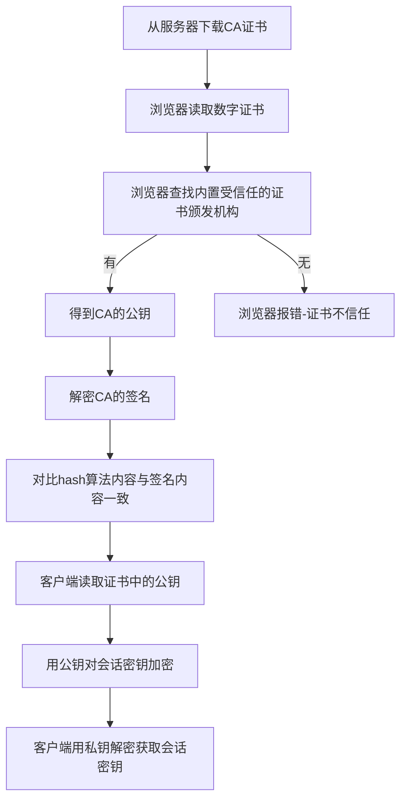
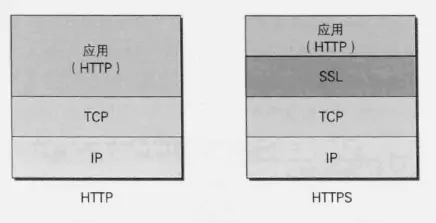

[https](https://juejin.im/post/5eb3c6065188255fd54de543?utm_source=gold_browser_extension)

| 加密方式 | 优点 | 缺点 |
|:---:|:---:|:---:|
|对称加密|速度快|密钥不可能一开始在发送方和接收方都全部生成好了 需要在一方生成之后传递给另一方 如果在传递过程密钥被劫持 整个加密就不安全了|
|非对称加密|较安全|1.加解密速度慢-数据传输效率降低 2.公钥对外公开 如果密文是私钥加密 那么任何人都能用公钥解密|
||||

## 重点总结：
1. 由于对称加密效率较高， 非对称加密较为安全，https采用的是混合加密。 用非对称加密方式（rsa）来的**公钥**加密会话密钥（aes的key）。
2. 首先由 客户端生成 会话密钥， 即aes的key, 传给服务端
3. 由服务端生成非对称加密的公私钥， 然后将公钥下发给客户端。

4. 为了确保服务器公钥不被**篡改**， 引入CA认证。

## Https流程图

## SSL/TLS

应用层协议

## Http与Https常用端口号
- HTTP协议代理服务器常用端口号：80/8080/3128/8081/9098
- HTTPS（securely transferring web pages）服务器，默认端口号为443/tcp  443/udp

## HTTPS的缺点

　　虽然说HTTPS有很大的优势，但其相对来说，还是存在不足之处的：

　　（1）HTTPS协议握手阶段比较费时，会使页面的加载时间延长近50%，增加10%到20%的耗电；

　　（2）HTTPS连接缓存不如HTTP高效，会增加数据开销和功耗，甚至已有的安全措施也会因此而受到影响；

　　（3）SSL证书需要钱，功能越强大的证书费用越高，个人网站、小网站没有必要一般不会用。

　   （4）SSL证书通常需要绑定IP，不能在同一IP上绑定多个域名，IPv4资源不可能支撑这个消耗。

　　（5）HTTPS协议的加密范围也比较有限，在黑客攻击、拒绝服务攻击、服务器劫持等方面几乎起不到什么作用。最关键的，SSL证书的信用链体系并不安全，特别是在某些国家可以控制CA根证书的情况下，中间人攻击一样可行。

