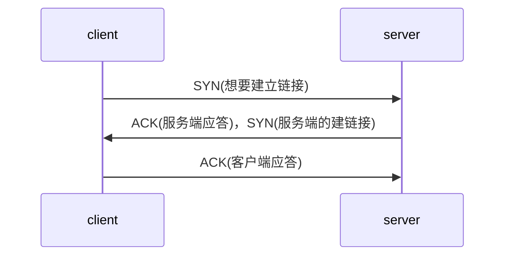
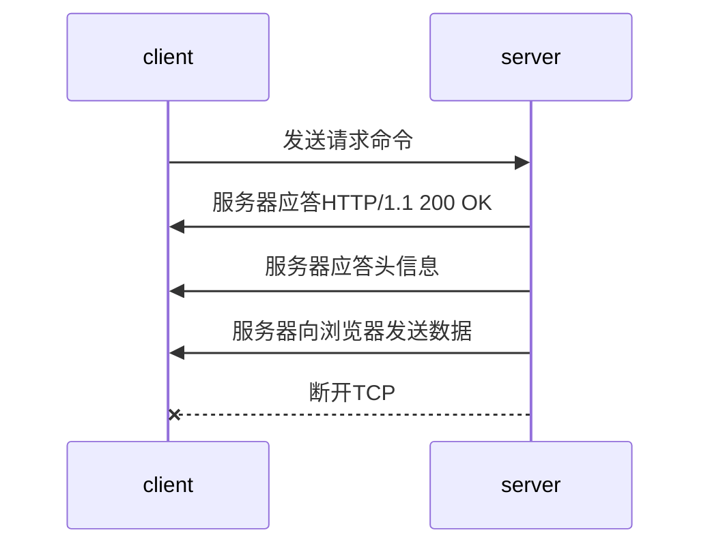
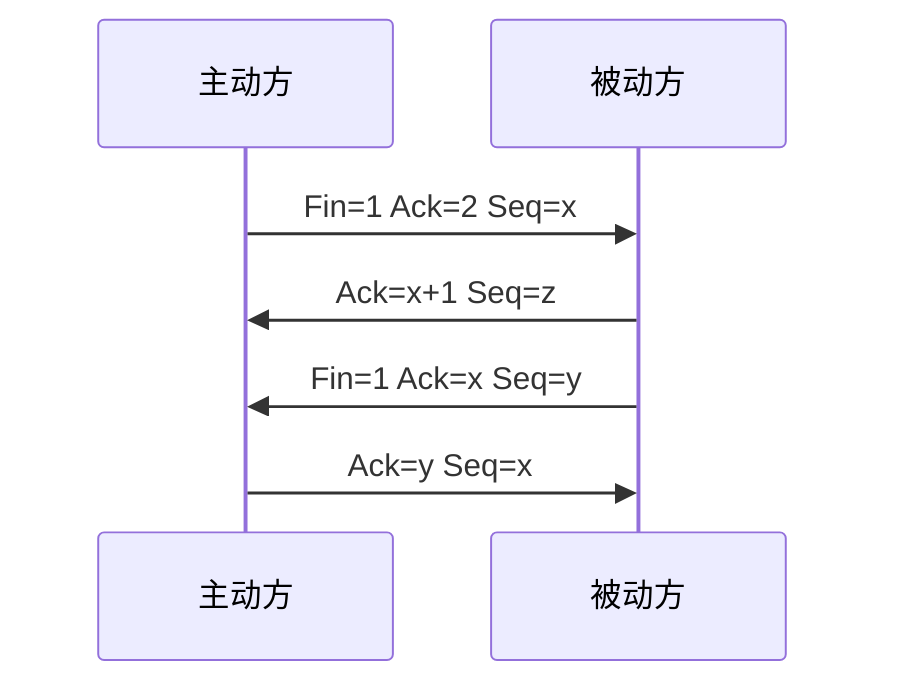
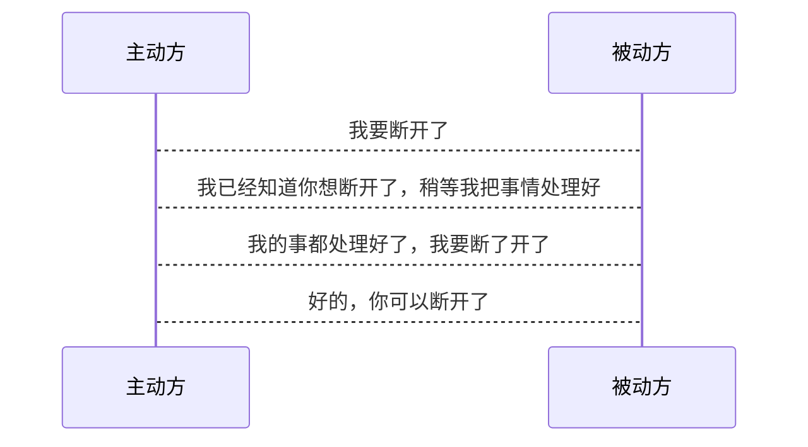

[细说浏览器输入URL后发生了什么](https://juejin.im/post/5e32449d6fb9a02fe4581907)

## 直接总结
******
可以分为六步

### 1. DNS域名解析

  简单来说就是找到域名对应的IP。
  查找IP的过程：
  ```mermaid
    graph LR
    浏览器缓存中 --> 本地host文件 --> 本地DNS解析器缓存 --> 本地DNS服务器 --> 域名服务器
  ```

### 2. 建立TCP连接

TCP处于网络层

先判断是不是https, https = http + SSL/TLS

- 第一次握手：客户端通过标志位发送SYN = j 给服务端，表面客户端想要建立连接，并进入SYN_SEND状态，等待服务器确认；  

- 第二次握手：服务端收到SYN标志后返回ACK =（j+1） 应答标志给客户端，同时自己也发送一个SYN包（syn=k），表面可以建立连接，此时服务器进入SYN_RECV状态。  

- 第三次握手：客户端收到服务端端SYN+ACK应答标志后回传ACK =（k+1）标志给服务端，说明自己已经收到了ACK标志，此包发送完毕，客户端和服务器进入ESTABLISHED状态,完成三次握手。



TCP一些字段的含义：

>SYN表示建立连接，  
FIN表示关闭连接，  
ACK表示响应，  
PSH表示有 DATA数据传输，
RST表示连接重置。  
seq表示封包序号


### 3. 发送http请求，服务器响应结果

http处于应用层，在建立TCP链接之后浏览器向服务器发送请求



### 4. 关闭TCP连接（长连接没有这一步）

需要四步， 称为四次挥手


说明：
1. 主动方发送Fin+Ack报文，并将发送序号改为X

2. 被动方发送Ack报文，并将发送序列改为Z，再确认序号为X+1

3. 被动方发送Fin+Ack报文，发送序号为Y，再确认序号为X

4. 主动方发送Ack报文， 发送序号为X，再确认序号为Y

**这里发送序号确认序号不理解，**
大致就是说主动方发一个结束的指令给被动方，被动方应答这个指定，被动发也发一个结束的指令给主动方，主动方应答这个指令。

**断开连接为什么要4次？**

为了确保双方的操作都已完成， 可以断开了。


### 5. 浏览器开始渲染
这里有单独的部分来说明