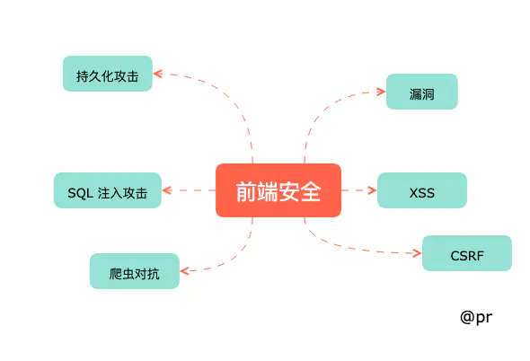

# 1. xss

## 什么是 XSS
Cross-Site Scripting（跨站脚本攻击）简称 XSS，是一种代码注入攻击。攻击者通过在目标网站上注入恶意脚本，使之在用户的浏览器上运行。利用这些恶意脚本，攻击者可获取用户的敏感信息如 Cookie、SessionID 等，进而危害数据安全。

为了和 CSS 区分，这里把攻击的第一个字母改成了 X，于是叫做 XSS。

XSS 的本质是：恶意代码未经过滤，与网站正常的代码混在一起；浏览器无法分辨哪些脚本是可信的，导致恶意脚本被执行。

## XSS 攻击的总结
我们回到最开始提出的问题，相信同学们已经有了答案：

- XSS 防范是后端 RD 的责任，后端 RD 应该在所有用户提交数据的接口，对敏感字符进行转义，才能进行下一步操作。


  不正确。因为：

  防范存储型和反射型 XSS 是后端 RD 的责任。而 DOM 型 XSS 攻击不发生在后端，是前端 RD 的责任。防范 XSS 是需要后端 RD 和前端 RD 共同参与的系统工程。
  转义应该在输出 HTML 时进行，而不是在提交用户输入时。


- 所有要插入到页面上的数据，都要通过一个敏感字符过滤函数的转义，过滤掉通用的敏感字符后，就可以插入到页面中。


  不正确。
  不同的上下文，如 HTML 属性、HTML 文字内容、HTML 注释、跳转链接、内联 JavaScript 字符串、内联 CSS 样式表等，所需要的转义规则不一致。
  业务 RD 需要选取合适的转义库，并针对不同的上下文调用不同的转义规则。

**整体的 XSS 防范是非常复杂和繁琐的，我们不仅需要在全部需要转义的位置，对数据进行对应的转义。而且要防止多余和错误的转义，避免正常的用户输入出现乱码。
虽然很难通过技术手段完全避免 XSS，但我们可以总结以下原则减少漏洞的产生：**

**利用模板引擎**
开启模板引擎自带的 HTML 转义功能。例如：
在 ejs 中，尽量使用 <%= data %> 而不是 <%- data %>；
在 doT.js 中，尽量使用 {{! data } 而不是 {{= data }；
在 FreeMarker 中，确保引擎版本高于 2.3.24，并且选择正确的 freemarker.core.OutputFormat。

**避免内联事件**
尽量不要使用 onLoad="onload('{{data}}')"、onClick="go('{{action}}')" 这种拼接内联事件的写法。在 JavaScript 中通过 .addEventlistener() 事件绑定会更安全。

**避免拼接 HTML**
前端采用拼接 HTML 的方法比较危险，如果框架允许，使用 createElement、setAttribute 之类的方法实现。或者采用比较成熟的渲染框架，如 Vue/React 等。

**时刻保持警惕**
在插入位置为 DOM 属性、链接等位置时，要打起精神，严加防范。
增加攻击难度，降低攻击后果
通过 CSP、输入长度配置、接口安全措施等方法，增加攻击的难度，降低攻击的后果。

**主动检测和发现**
可使用 XSS 攻击字符串和自动扫描工具寻找潜在的 XSS 漏洞。


# 2. CSRF
## 什么是CSRF

CSRF（Cross-site request forgery）跨站请求伪造：攻击者诱导受害者进入第三方网站，在第三方网站中，向被攻击网站发送跨站请求。利用受害者在被攻击网站已经获取的注册凭证，绕过后台的用户验证，达到**冒充用户**对被攻击的网站执行某项操作的目的。

## 一个典型的CSRF攻击有着如下的流程

1. 受害者登录a.com，并保留了登录凭证（Cookie）。
2. 攻击者引诱受害者访问了b.com。
3. b.com 向 a.com 发送了一个请求：a.com/act=xx。浏览器会默认携带a.com的Cookie
4. a.com接收到请求后，对请求进行验证，并确认是受害者的凭证，误以为是受害者自己发送的请求。
5. a.com以受害者的名义执行了act=xx。
攻击完成，攻击者在受害者不知情的情况下，冒充受害者，让a.com执行了自己定义的操作。

## 几种常见的CSRF攻击类型
- GET类型的CSRF

GET类型的CSRF利用非常简单，只需要一个HTTP请求，一般会这样利用：
```javascript
  
```

在受害者访问含有这个img的页面后，浏览器会自动向http://bank.example/withdraw?account=xiaoming&amount=10000&for=hacker发出一次HTTP请求。bank.example就会收到包含受害者登录信息的一次跨域请求。

- POST类型的CSRF

这种类型的CSRF利用起来通常使用的是一个自动提交的表单，如：

```javascript
 <form action="http://bank.example/withdraw" method=POST >
    <input type="hidden" name="account" value="xiaoming" />
    <input type="hidden" name="amount" value="10000" />
    <input type="hidden" name="for" value="hacker" />
</form>
<script> document.forms[0].submit(); </script> 
```
访问该页面后，表单会自动提交，相当于模拟用户完成了一次POST操作。

POST类型的攻击通常比GET要求更加严格一点，但仍并不复杂。任何个人网站、博客，被黑客上传页面的网站都有可能是发起攻击的来源，后端接口不能将安全寄托在仅允许POST上面。

- 链接类型的CSRF

链接类型的CSRF并不常见，比起其他两种用户打开页面就中招的情况，这种需要用户点击链接才会触发。这种类型通常是在论坛中发布的图片中嵌入恶意链接，或者以广告的形式诱导用户中招，攻击者通常会以比较夸张的词语诱骗用户点击，例如：

```javascript
  <a href="http://test.com/csrf/withdraw.php?amount=1000&for=hacker" taget="_blank">
  重磅消息！！
  <a/>

```
由于之前用户登录了信任的网站A，并且保存登录状态，只要用户主动访问上面的这个PHP页面，则表示攻击成功。

## CSRF的特点

- 攻击一般发起在第三方网站，而不是被攻击的网站。被攻击的网站无法防止攻击发生。
- 攻击利用受害者在被攻击网站的登录凭证，冒充受害者提交操作；而不是直接窃取数据。
- 整个过程攻击者并不能获取到受害者的登录凭证，仅仅是“冒用”。
- 跨站请求可以用各种方式：图片URL、超链接、CORS、Form提交等等。部分请求方式可以直接嵌入在第三方论坛、文章中，难以进行追踪。

CSRF通常是跨域的，因为外域通常更容易被攻击者掌控。但是如果本域下有容易被利用的功能，比如可以发图和链接的论坛和评论区，攻击可以直接在本域下进行，而且这种攻击更加危险。

## 防护策略

CSRF通常从第三方网站发起，被攻击的网站无法防止攻击发生，只能通过增强自己网站针对CSRF的防护能力来提升安全性。
上文中讲了CSRF的两个特点：

CSRF（通常）发生在第三方域名。
CSRF攻击者不能获取到Cookie等信息，只是使用。

针对这两点，我们可以专门制定防护策略，如下：

- 阻止不明外域的访问

同源检测
Samesite Cookie

- 提交时要求附加本域才能获取的信息

CSRF Token
双重Cookie验证

## 详细说明
- Samesite

Google起草了一份草案来改进HTTP协议，那就是为Set-Cookie响应头新增Samesite属性，它用来标明这个 Cookie是个“同站 Cookie”，同站Cookie只能作为第一方Cookie，不能作为第三方Cookie，Samesite 有两个属性值，分别是 Strict 和 Lax。

**Samesite=Strict**
这种称为严格模式，表明这个 Cookie 在任何情况下都不可能作为第三方 Cookie，绝无例外。

**Samesite=Lax**
这种称为宽松模式，比 Strict 放宽了点限制：假如这个请求是这种请求（改变了当前页面或者打开了新页面）且同时是个GET请求，则这个Cookie可以作为第三方Cookie。


