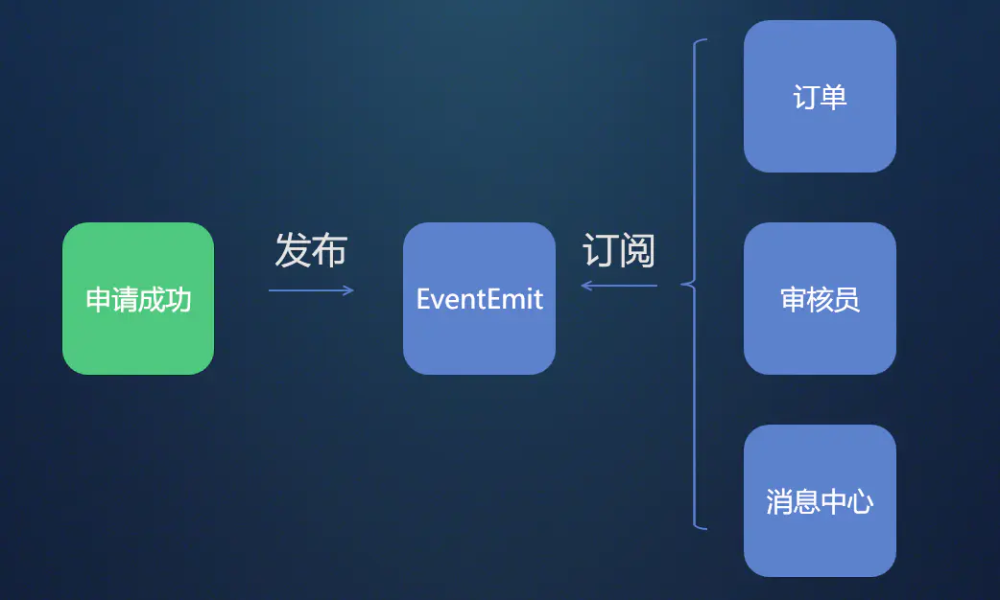
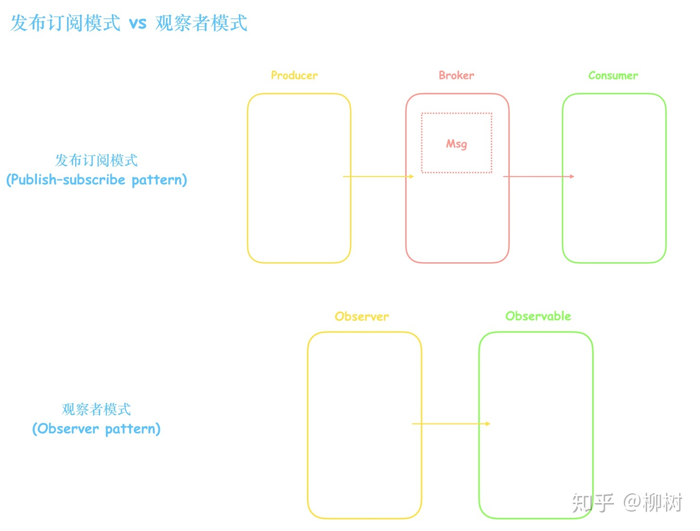
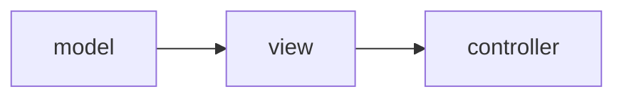
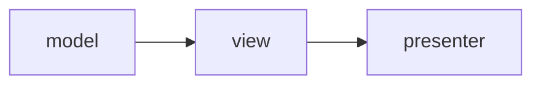
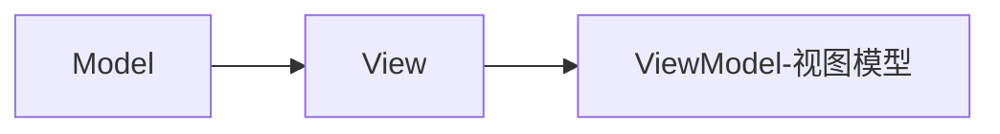

# 常用设计模式总结

## 策略模式
对于多条件判断， 且互相独立且可以复用得时候。
各策略相对复杂。

example: 表单验证

```javascript
// 效验策略
let checkStrategy = function () {
  let strategy = {
    notNull: function (value) {
      return /\s+/.test(value)
    }
  }

  return {
    check: function (type, value) {
      return strategy[type] ? stratekgy[type][value] : '没有这种策略'
    },
    
    addStrategy () {
      // 手动添加新策略
    }
  }
}

let checkStrategy = checkStrategy()
checkStrategy.check('notNull', 'aaa')
```

## 发布订阅模式


其实就是通过一个对象管理触发订阅者得回调方法。

```javascript
const EventEmit = function() {
  this.events = {};
  this.on = function(name, cb) {
    if (this.events[name]) {
      this.events[name].push(cb);
    } else {
      this.events[name] = [cb];
    }
  };
  this.trigger = function(name, ...arg) {
    if (this.events[name]) {
      this.events[name].forEach(eventListener => {
        eventListener(...arg);
      });
    }
  };
};

```
以下条件下可以考虑使用：

- 各模块相互独立
- 存在一对多的依赖关系
- 依赖模块不稳定、依赖关系不稳定

## 观察者模式

这里首先要区别于发布订阅模式。
- 发布订阅模式就是一种观察者模式
- 发布订阅模式是有个调度中心， 首先大家都往调度中心订阅某个事件， 一但发布大家都会触发， 可以做到对某一个事件得统一管理。
- 观察者模式是订阅者和发布者直接联系，不利于解耦



## 工厂模式
工厂模式简单地说 就是根据不同参数，返回不同得实例
直接上代码:
```javascript
let Factory = function (type, content) {
  /* 防止直接调用Factoty */
  if (this instanceof Factory) {
    return new this[type](content)
  } else {
    return new Factory(type, content)
  }
}

Factory.prototype = {
  Java: function (content) {
    this.content = content
    console.log('java')
  },
  Javascript: function (content) {
    this.content = content
    console.log('javascript')
  }
}

```

## 单例模式
单例模式是只允许实例化一次的对象类。有时我们也用一个对象来规划一个命名空间，井井有条地管理对象上的属性与方法。

```javascript
// $就是一个单例
$ = {
  getDom () {
    // 
  },

  set () {}
}
```

## 中介者模式
中介者的实现与观察者模式非常像。但还是有些区别：

中介者模式注重状态告知，观察者模式侧重组件数据通信，其实我们这里完全使用观察者模式也可以实现状态告知，不过 但观察者是分发性的，所有的观察者都会受到信息，而且中介者则是单一的，对象的通信由中介者处理。

example: 聊天室就是一个典型的中介者

```javascript

var Participant = function(name) {
    this.name = name;
    this.chatroom = null;
};
Participant.prototype = {
    send: function(message, to) {
        this.chatroom.send(message, this, to);
    },
    receive: function(message, from) {
        log.add(from.name + " to " + this.name + ": " + message);
    }
};
var Chatroom = function() {
    var participants = {};

    return {

        register: function(participant) {
            participants[participant.name] = participant;
            participant.chatroom = this;
        },

        send: function(message, from, to) {
            if (to) {
                to.receive(message, from);
            } else {
                for (key in participants) {
                    if (participants[key] !== from) {
                        participants[key].receive(message, from);
                    }
                }
            }
        }
    };
// 在示例代码中我们有四个参与者，加入聊天会话通过注册一个聊天室（中介）。

// 这里的聊天室对象就起到了中介的作用，协调其他的对象，进行合理的组织，降低耦合。

// 由此可见中介者可以做到点对点的消息通知， 而观察者是直接广播给所有订阅者
```

## 节流模式和防抖模式

先来说一下节流和防抖的区别： 
- 节流在一定时间内只执行一次， scroll、touchmove
- 防抖是取消上一次，只执行最后一次

```javascript
// 节流
function throttle(fn,delay=100){
	//首先设定一个变量，在没有执行我们的定时器时为null
	let timer = null;
	return function(){
		//当我们发现这个定时器存在时，则表示定时器已经在运行中，需要返回
		if(timer) return;
		timer = setTimeout(()=>{
			fn.apply(this,arguments);
			timer = null;
		},delay);
	}
}
```

```javascript
// 防抖
function debounce(fn,delay=200){
	let timer = null;
	return function(){
    // 通过clearTimeout来实现只执行最后一次
		if(timer) clearTimeout(timer);
		timer = setTimeout(()=>{
			fn.apply(this,arguments);
			timer = null;
		},delay);
	}
}
```

# 以下时属于架构型设计模式

## MVC 模式

model: 数据层

- 页面配置数据
- 服务端接口返回数据

view: 视图层

- 页面视图

contraller: 逻辑控制层

- 业务逻辑


## MVP 模式
由于复杂业务MVC模式中视图层常常直接访问数据层中得数据， 这样得问题是，控制层并不知道数据层中数据已被修改。最终影响视图渲染。

因此演化出 MVP 模式， 目的是数据层与书图层解耦


view层不能直接访问model中得数据，而是通过persenter来实现对model层内数据得访问。
所有层次得交互都是发生在presenter层。

```javascript
MVP.presenter = function () {
  /* 渲染view */
  let V = MVP.view

  let M = MVP.model

  return {
    renderTitle () {
      /* 类似于这样， presenter直接访问model中的数据 渲染出view */
      V.renderTitle(M.title)
    }
  }
}
```

## MVVM 模式

对于大型应用MVP模式中的persenter 将会很复杂


- MVVM本质就是基于操作数据来操作视图进而操作DOM
- ViewModel是View和Model的关系映射
- 在MVVM中View和Model是不可以直接进行通信的，它们之间存在这ViewModel这个中介充当着观察者的角色。当用户操作View，ViewModel感知到变化，然后通知Model发生相应改变，反之亦然。ViewModel向上与视图层View进行双向数据绑定，向下与Model通过接口请求进行数据交互，起到承上启下的作用
vue 就是mvvm 的一种实现


